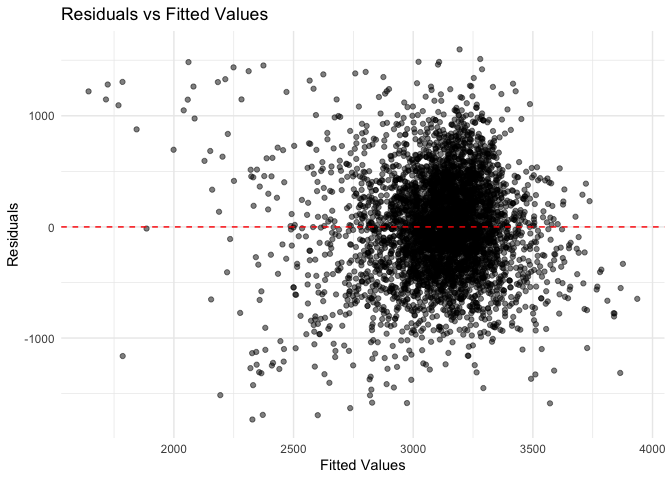
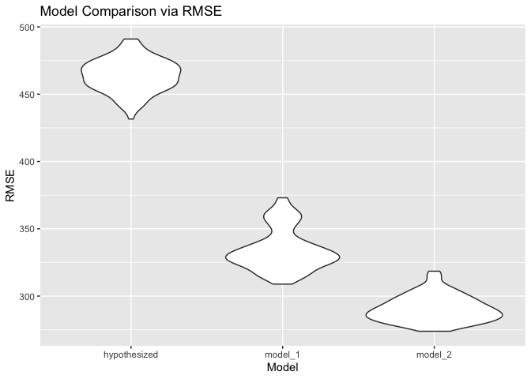

P8105 HW 6
================
Kaleb J. Frierson
2024-11-23

# Homework Introduction

This assignment from Data Science I draws on the Linear Models unit.
This includes the linear models, cross validation, and bootstrapping
lectures. Necessary data has been moved into the working directory of
this repository saved R project. Formatting has been carried out per
guidelines for problem 0.

## Library Calling

Below all needed libraries are loaded:

``` r
library(tidyverse)
library(broom)
library(modelr)
library(knitr)
library(purrr)
```

# Problem 1

The below code chunk below adapted from the course website download’s
Central Park weather data from 2017:

``` r
weather_df = 
  rnoaa::meteo_pull_monitors(
    c("USW00094728"),
    var = c("PRCP", "TMIN", "TMAX"), 
    date_min = "2017-01-01",
    date_max = "2017-12-31") %>%
  mutate(
    name = recode(id, USW00094728 = "CentralPark_NY"),
    tmin = tmin / 10,
    tmax = tmax / 10) %>%
  select(name, id, everything())
```

Create `bootstrap_1` `function` that returns a `tibble` with values of
r2, b0, and b1:

``` r
bootstrap_1 = 
  
  function(df) {
  
    boot_df = sample_frac(df, replace = TRUE)
    
    boot_model = lm(tmax ~ tmin, data = boot_df)
    
    r_squared = glance(boot_model)$r.squared
    
    coefs = tidy(boot_model)
    
    log_beta_product = log(coefs$estimate[1] * coefs$estimate[2])
  
  return(tibble(r_squared = r_squared, log_beta_product = log_beta_product))
}
```

Use `map_dfr` to apply the `function` 5000 times:

``` r
output_bs1 = map_dfr(1:5000, ~bootstrap_1(weather_df))
```

`ggplot` r2:

``` r
r2plot = 
  output_bs1 |> 
  ggplot(aes(x = r_squared)) +
  geom_density(fill = "skyblue", alpha = 0.5) +
  labs(
    title = "Bootstrap Distribution of R-squared", 
    x = "R-squared", 
    y = "Density")

r2plot
```

<!-- -->

`ggplot` log(b0 \* b0):

``` r
logplot = 
  output_bs1 |>
  ggplot(aes(x = log_beta_product)) +
  geom_density(fill = "salmon", alpha = 0.5) +
  labs(
    title = "Bootstrap Distribution of log(beta0 * beta1)", 
    x = "log(beta0 * beta1)", 
    y = "Density")

logplot
```

-1.png)<!-- -->

Compute point estimates and CIs using `summarize` and `knitr:kalble`:

``` r
bootstrap_summary = 
  output_bs1 |> 
  summarize(
    r_squared_mean = mean(r_squared),
    r_squared_ci_ll = quantile(r_squared, 0.025),
    r_squared_ci_ul = quantile(r_squared, 0.975),
    log_beta_product_mean = mean(log_beta_product),
    log_beta_product_ci_ll = quantile(log_beta_product, 0.025),
    log_beta_product_ci_ul = quantile(log_beta_product, 0.975)
  )|> 
  pivot_longer(
    cols = everything(),
    names_to = c("metric", ".value"),
    names_pattern = "(.*)_(mean|ci_ll|ci_ul)"
)

bootstrap_summary |> 
  kable(
    digits = 3,               
    col.names = c("Estimate", "Mean", "CI Lower", "CI Upper"),
    caption = "Bootstrap Summary Table"
  )
```

| Estimate         |  Mean | CI Lower | CI Upper |
|:-----------------|------:|---------:|---------:|
| r_squared        | 0.911 |    0.894 |    0.927 |
| log_beta_product | 2.013 |    1.967 |    2.059 |

Bootstrap Summary Table

**Describe distribution of estimates in words**:

The distribution of r2 estimates is approximately normal with a mean of
0.912 (95% CI 0.894, 0.927). The distribution of log(b0\*b1) estimates
is approximately normal with a mean of 2.013 (95% CI 1.967, 2.058).

# Problem 2

Below I read in homicide data from TWJ using `read_csv`. Note that age
is not numeric.

``` r
homicides = 
  read_csv(
    "local data/homicide-data.csv",
    na = c("Unknown", "NA", "", ".")) |> 
  janitor::clean_names() 
```

    ## Rows: 52179 Columns: 12
    ## ── Column specification ────────────────────────────────────────────────────────
    ## Delimiter: ","
    ## chr (8): uid, victim_last, victim_first, victim_race, victim_sex, city, stat...
    ## dbl (4): reported_date, victim_age, lat, lon
    ## 
    ## ℹ Use `spec()` to retrieve the full column specification for this data.
    ## ℹ Specify the column types or set `show_col_types = FALSE` to quiet this message.

``` r
spec(homicides)
```

    ## cols(
    ##   uid = col_character(),
    ##   reported_date = col_double(),
    ##   victim_last = col_character(),
    ##   victim_first = col_character(),
    ##   victim_race = col_character(),
    ##   victim_age = col_double(),
    ##   victim_sex = col_character(),
    ##   city = col_character(),
    ##   state = col_character(),
    ##   lat = col_double(),
    ##   lon = col_double(),
    ##   disposition = col_character()
    ## )

Use `mutate` to create a city_state variable (e.g. “Baltimore, MD”), and
a binary variable indicating whether the homicide is solved. Use
`filter` to Omit cities Dallas, TX; Phoenix, AZ; and Kansas City, MO –
these don’t report victim race. Also omit Tulsa, AL – this is a data
entry mistake. Limit your analysis those for whom `victim_race` is white
or black. Be sure that `victim_age` is treated `as.numeric`:

``` r
homicides = 
  homicides |> 
  mutate(
    city_state = paste(city, state, sep = ", "),
    solved = if_else(disposition == "Closed by arrest", 1, 0),
    victim_age = as.numeric(victim_age)
  ) |> 
  filter(
    !city_state %in% c("Dallas, TX", "Phoenix, AZ", "Kansas City, MO", "Tulsa, AL"),
    victim_race %in% c("White", "Black")
  )
```

For the city of Baltimore, MD, use the `glm` function to fit a logistic
regression with resolved vs unresolved as the outcome and victim age,
sex and race as predictors. Save the output of `glm` as an `R object`;
apply the `broom::tidy` to this object; and obtain the estimate and
confidence interval of the adjusted odds ratio (by exponentiation of the
estimate, `exponentiate = TRUE`) for solving homicides comparing male
victims to female victims keeping all other variables fixed.

``` r
baltimore_df = 
  homicides |> 
  filter(city_state == "Baltimore, MD")

baltimore_model = 
  glm(
  solved ~ victim_age + victim_sex + victim_race,
  data = baltimore_df,
  family = "binomial"
)

baltimore_results = 
  broom::tidy(baltimore_model, conf.int = TRUE, exponentiate = TRUE) |> 
  filter(term == "victim_sexMale") |> 
  select(estimate, conf.low, conf.high)

baltimore_results |> 
  kable(
    digits = 2,               
    col.names = c("OR Estimate", "CI Lower", "CI Upper")
  )
```

| OR Estimate | CI Lower | CI Upper |
|------------:|---------:|---------:|
|        0.43 |     0.32 |     0.56 |

Run `glm` for each of the cities in your dataset, and extract the
adjusted odds ratio (and CI) for solving homicides comparing male
victims to female victims. Do this within a “tidy” pipeline, making use
of `purrr::map`, list columns, and `unnest` as necessary to create a
dataframe with estimated ORs and CIs for each city:

``` r
city_results = 
  homicides |> 
  group_by(city_state) |> 
  nest() |> 
  mutate(
    model = 
      map(data, ~ glm(solved ~ victim_age + victim_sex + victim_race, 
          data = .x, family = "binomial")),
    results = 
      map(model, ~ broom::tidy(.x, conf.int = TRUE, exponentiate = TRUE))
  ) |> 
  unnest(results) |> 
  filter(term == "victim_sexMale") |> 
  select(city_state, estimate, conf.low, conf.high)

city_results |> 
  kable(
    digits = 3,               
    col.names = c("City, State", "OR Estimate", "CI Lower", "CI Upper"),
    caption = "All City Regression Results"
  )
```

| City, State        | OR Estimate | CI Lower | CI Upper |
|:-------------------|------------:|---------:|---------:|
| Albuquerque, NM    |       1.767 |    0.825 |    3.762 |
| Atlanta, GA        |       1.000 |    0.680 |    1.458 |
| Baltimore, MD      |       0.426 |    0.324 |    0.558 |
| Baton Rouge, LA    |       0.381 |    0.204 |    0.684 |
| Birmingham, AL     |       0.870 |    0.571 |    1.314 |
| Boston, MA         |       0.667 |    0.351 |    1.260 |
| Buffalo, NY        |       0.521 |    0.288 |    0.936 |
| Charlotte, NC      |       0.884 |    0.551 |    1.391 |
| Chicago, IL        |       0.410 |    0.336 |    0.501 |
| Cincinnati, OH     |       0.400 |    0.231 |    0.667 |
| Columbus, OH       |       0.532 |    0.377 |    0.748 |
| Denver, CO         |       0.479 |    0.233 |    0.962 |
| Detroit, MI        |       0.582 |    0.462 |    0.734 |
| Durham, NC         |       0.812 |    0.382 |    1.658 |
| Fort Worth, TX     |       0.669 |    0.394 |    1.121 |
| Fresno, CA         |       1.335 |    0.567 |    3.048 |
| Houston, TX        |       0.711 |    0.557 |    0.906 |
| Indianapolis, IN   |       0.919 |    0.678 |    1.241 |
| Jacksonville, FL   |       0.720 |    0.536 |    0.965 |
| Las Vegas, NV      |       0.837 |    0.606 |    1.151 |
| Long Beach, CA     |       0.410 |    0.143 |    1.024 |
| Los Angeles, CA    |       0.662 |    0.457 |    0.954 |
| Louisville, KY     |       0.491 |    0.301 |    0.784 |
| Memphis, TN        |       0.723 |    0.526 |    0.984 |
| Miami, FL          |       0.515 |    0.304 |    0.873 |
| Milwaukee, wI      |       0.727 |    0.495 |    1.054 |
| Minneapolis, MN    |       0.947 |    0.476 |    1.881 |
| Nashville, TN      |       1.034 |    0.681 |    1.556 |
| New Orleans, LA    |       0.585 |    0.422 |    0.812 |
| New York, NY       |       0.262 |    0.133 |    0.485 |
| Oakland, CA        |       0.563 |    0.364 |    0.867 |
| Oklahoma City, OK  |       0.974 |    0.623 |    1.520 |
| Omaha, NE          |       0.382 |    0.199 |    0.711 |
| Philadelphia, PA   |       0.496 |    0.376 |    0.650 |
| Pittsburgh, PA     |       0.431 |    0.263 |    0.696 |
| Richmond, VA       |       1.006 |    0.483 |    1.994 |
| San Antonio, TX    |       0.705 |    0.393 |    1.238 |
| Sacramento, CA     |       0.669 |    0.326 |    1.314 |
| Savannah, GA       |       0.867 |    0.419 |    1.780 |
| San Bernardino, CA |       0.500 |    0.166 |    1.462 |
| San Diego, CA      |       0.413 |    0.191 |    0.830 |
| San Francisco, CA  |       0.608 |    0.312 |    1.155 |
| St. Louis, MO      |       0.703 |    0.530 |    0.932 |
| Stockton, CA       |       1.352 |    0.626 |    2.994 |
| Tampa, FL          |       0.808 |    0.340 |    1.860 |
| Tulsa, OK          |       0.976 |    0.609 |    1.544 |
| Washington, DC     |       0.691 |    0.466 |    1.014 |

All City Regression Results

Use `ggplot` to show the estimated ORs and CIs for each city. Organize
cities according to estimated OR:

``` r
city_results = 
  city_results |> 
  mutate(city_state = fct_reorder(city_state, estimate))

city_results |>
  ggplot(aes(x = estimate, y = city_state)) +
  geom_point() +
  geom_errorbarh(
    aes(xmin = conf.low, xmax = conf.high), height = 0.2) +
  labs(
    title = "Adjusted Odds Ratios for Solving Homicides (Male vs Female)",
    x = "Adjusted Odds Ratio (Male vs Female)",
    y = "City"
  ) +
  theme_minimal()
```

<!-- -->

**Comment on the plot**: the adjusted OR comparing odds of a male
homicide being solved to a female homicide being solved when controlling
for age, sex, and race is higher than 1 in Fresno, CA; Stockton, CA;
Nashville, TN; and Albuquerque, NM. It is equal to 1 in Richmond, VA;
and Atlanta, GA. In the rest of the cities it is less than 1. The
confidence intervals are all very wide and often cross the null.
However, on average it seems that men are less likely than women to have
their homicide solved. For the reader, plot readability is best in your
browser and not in R studio’s platform.

# Problem 3

Bring in the birtweight data and `mutate` it such that variables coded
as 1, 2, etc aren’t treated as continuous:

``` r
bwt_df = 
  read_csv("local data/birthweight.csv")
```

    ## Rows: 4342 Columns: 20
    ## ── Column specification ────────────────────────────────────────────────────────
    ## Delimiter: ","
    ## dbl (20): babysex, bhead, blength, bwt, delwt, fincome, frace, gaweeks, malf...
    ## 
    ## ℹ Use `spec()` to retrieve the full column specification for this data.
    ## ℹ Specify the column types or set `show_col_types = FALSE` to quiet this message.

``` r
spec(bwt_df)
```

    ## cols(
    ##   babysex = col_double(),
    ##   bhead = col_double(),
    ##   blength = col_double(),
    ##   bwt = col_double(),
    ##   delwt = col_double(),
    ##   fincome = col_double(),
    ##   frace = col_double(),
    ##   gaweeks = col_double(),
    ##   malform = col_double(),
    ##   menarche = col_double(),
    ##   mheight = col_double(),
    ##   momage = col_double(),
    ##   mrace = col_double(),
    ##   parity = col_double(),
    ##   pnumlbw = col_double(),
    ##   pnumsga = col_double(),
    ##   ppbmi = col_double(),
    ##   ppwt = col_double(),
    ##   smoken = col_double(),
    ##   wtgain = col_double()
    ## )

``` r
bwt_df = 
  bwt_df |> 
  mutate(
    babysex = factor(babysex, levels = c(1, 2), 
                     labels = c("Male", "Female")),
    frace = factor(frace),
    mrace = factor(mrace),
    malform = factor(malform),
    smoken = as.numeric(smoken)
  ) |> 
  drop_na()
```

Propose a regression model for birthweight. This model may be based on a
hypothesized structure for the factors that underly birthweight:

``` r
bwt_model1 = 
  lm(bwt ~ gaweeks + 
       ppbmi + 
       smoken + 
       parity + 
       malform +
       pnumlbw,
     data = bwt_df)
```

**Describe your modeling process**: I looked for variables that I don’t
suspect to increase multi-colinearity. For example, I know from previous
knowledge that birthweight is correlated with a child’s dimensions and
with the mother’s weight at delivery so I chose not to use those
variables. I was curious about the effects of previous medical problems
and risk factors so I chose to regress `bwt` on `gaweeks`, controlling
for `smoken`, `parity`, `malform`, `pnumlbw`. But Kaleb, isn’t there a
clear relationship between gestational age and weight? Yes, but that
relationship is important clinically and indicative of medical
conditions and thus I think a meaningful predictor to test.

Use `ggplot` to show residuals graphed against fitted values Use
`add_predictions` and `add_residuals` in making this plot:

``` r
bwt_df = 
  bwt_df |> 
  add_predictions(bwt_model1) |> 
  add_residuals(bwt_model1)

bwt_df |> 
ggplot(aes(x = pred, y = resid)) +
  geom_point(alpha = 0.5) +
  geom_hline(yintercept = 0, 
             color = "red", 
             linetype = "dashed") +
  labs(
    title = "Residuals vs Fitted Values",
    x = "Fitted Values",
    y = "Residuals"
  ) +
  theme_minimal()
```

<!-- -->

**Comment on plot of residuals v fitted values**: Hmmmm… I think
linearity is met. Not entirely sure on homoscedasticity…

Compare the first model to one using length at birth and gestational age
as predictors (main effects only). Also compare it to one using head
circumference, length, sex, and all interactions (including the
three-way interaction) between these. Use `crossv_mc` and functions in
`purrr` as appropriate:

``` r
cv_df = 
  crossv_mc(bwt_df, 100) |> 
  mutate(
    train = map(train, as_tibble),
    test = map(test, as_tibble)
  )

cv_res_df = 
  cv_df |> 
  mutate(
    hypothesized_mod = 
      map(train, ~ lm(bwt ~ gaweeks + 
       ppbmi + 
       smoken + 
       parity + 
       malform +
       pnumlbw, data = .)),
    model_1 = 
      map(train, ~ lm(bwt ~ blength + gaweeks, data = .)),
    model_2 = 
      map(train, ~ lm(bwt ~ bhead +
                        blength + 
                        babysex +
                        bhead*blength + 
                        bhead*babysex +
                        blength*babysex, data = .))
  ) |> 
  mutate(
    rmse_hypothesized = map2_dbl(hypothesized_mod, test, rmse),
    rmse_model_1 = map2_dbl(model_1, test, rmse),
    rmse_model_2 = map2_dbl(model_2, test, rmse)
  )

cv_summary = 
  cv_res_df |> 
  select(starts_with("rmse")) |> 
  pivot_longer(
    everything(),
    names_to = "model", 
    values_to = "rmse",
    names_prefix = "rmse_"
  )

cv_summary |> 
  ggplot(aes(x = model, y = rmse)) + 
  geom_violin() +
  labs(
    title = "Model Comparison via RMSE",
    x = "Model",
    y = "RMSE"
  )
```

<!-- -->

**Comments**: My model was worse than the other models (RMSE \> 400).
This might be due to outliars seen in the plot of fitted values and
residuals. I also included more variables which increases opportunities
for error. Model 1 has higher root mean square error than model 2 but
model 2 gives a warning `prediction from rank-deficient fit`. This could
be due to too many colinear variables or too many predictors for too few
observations (I don’t think the latter is as likely as the former).
