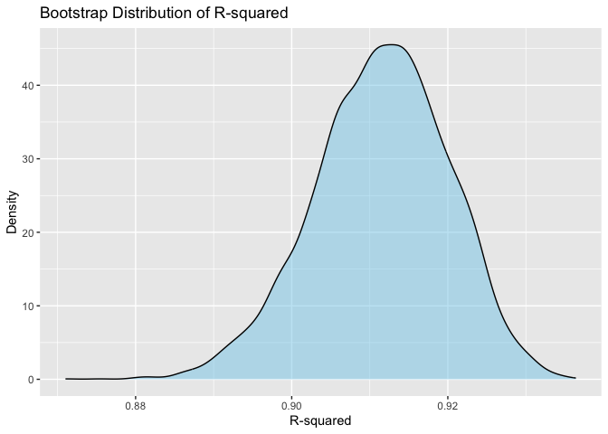
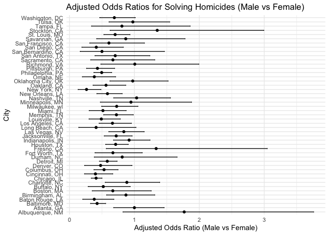

P8105 HW 6
================
Kaleb J. Frierson
2024-11-23

# Homework Introduction

This assignment from Data Science I draws on the Linear Models unit.
This includes the linear models, cross validation, and bootstrapping
lectures. Necessary data has been moved into the working directory of
this repository saved R project. Formatting has been carried out per
guidelines for problem 0.

## Library Calling

Below all needed libraries are loaded:

``` r
library(tidyverse)
library(broom)
library(modelr)
library(knitr)
library(purrr)
```

# Problem 1

The below code chunk below adapted from the course website download’s
Central Park weather data from 2017:

``` r
weather_df = 
  rnoaa::meteo_pull_monitors(
    c("USW00094728"),
    var = c("PRCP", "TMIN", "TMAX"), 
    date_min = "2017-01-01",
    date_max = "2017-12-31") %>%
  mutate(
    name = recode(id, USW00094728 = "CentralPark_NY"),
    tmin = tmin / 10,
    tmax = tmax / 10) %>%
  select(name, id, everything())
```

Create `bootstrap_1` `function` that returns a `tibble` with values of
r2, b0, and b1:

``` r
bootstrap_1 = 
  
  function(df) {
  
    boot_df = sample_frac(df, replace = TRUE)
    
    boot_model = lm(tmax ~ tmin, data = boot_df)
    
    r_squared = glance(boot_model)$r.squared
    
    coefs = tidy(boot_model)
    
    log_beta_product = log(coefs$estimate[1] * coefs$estimate[2])
  
  return(tibble(r_squared = r_squared, log_beta_product = log_beta_product))
}
```

Use `map_dfr` to apply the `function` 5000 times:

``` r
output_bs1 = map_dfr(1:5000, ~bootstrap_1(weather_df))
```

`ggplot` r2:

``` r
r2plot = 
  output_bs1 |> 
  ggplot(aes(x = r_squared)) +
  geom_density(fill = "skyblue", alpha = 0.5) +
  labs(
    title = "Bootstrap Distribution of R-squared", 
    x = "R-squared", 
    y = "Density")

r2plot
```

<!-- -->

`ggplot` log(b0 \* b0):

``` r
logplot = 
  output_bs1 |>
  ggplot(aes(x = log_beta_product)) +
  geom_density(fill = "salmon", alpha = 0.5) +
  labs(
    title = "Bootstrap Distribution of log(beta0 * beta1)", 
    x = "log(beta0 * beta1)", 
    y = "Density")

logplot
```

-1.png)<!-- -->

Compute point estimates and CIs using `summarize` and `knitr:kalble`:

``` r
bootstrap_summary = 
  output_bs1 |> 
  summarize(
    r_squared_mean = mean(r_squared),
    r_squared_ci_ll = quantile(r_squared, 0.025),
    r_squared_ci_ul = quantile(r_squared, 0.975),
    log_beta_product_mean = mean(log_beta_product),
    log_beta_product_ci_ll = quantile(log_beta_product, 0.025),
    log_beta_product_ci_ul = quantile(log_beta_product, 0.975)
  )|> 
  pivot_longer(
    cols = everything(),
    names_to = c("metric", ".value"),
    names_pattern = "(.*)_(mean|ci_ll|ci_ul)"
)

bootstrap_summary |> 
  kable(
    digits = 3,               
    col.names = c("Estimate", "Mean", "CI Lower", "CI Upper"),
    caption = "Bootstrap Summary Table"
  )
```

| Estimate         |  Mean | CI Lower | CI Upper |
|:-----------------|------:|---------:|---------:|
| r_squared        | 0.912 |    0.895 |    0.928 |
| log_beta_product | 2.013 |    1.963 |    2.059 |

Bootstrap Summary Table

**Describe distribution of estimates in words**:

The distribution of r2 estimates is approximately normal with a mean of
0.912 (95% CI 0.894, 0.927). The distribution of log(b0\*b1) estimates
is approximately normal with a mean of 2.013 (95% CI 1.967, 2.058).

# Problem 2

Below I read in homicide data from TWJ using `read_csv`. Note that age
is not numeric.

``` r
homicides = 
  read_csv(
    "local data/homicide-data.csv",
    na = c("Unknown", "NA", "", ".")) |> 
  janitor::clean_names() 
```

    ## Rows: 52179 Columns: 12
    ## ── Column specification ────────────────────────────────────────────────────────
    ## Delimiter: ","
    ## chr (8): uid, victim_last, victim_first, victim_race, victim_sex, city, stat...
    ## dbl (4): reported_date, victim_age, lat, lon
    ## 
    ## ℹ Use `spec()` to retrieve the full column specification for this data.
    ## ℹ Specify the column types or set `show_col_types = FALSE` to quiet this message.

``` r
spec(homicides)
```

    ## cols(
    ##   uid = col_character(),
    ##   reported_date = col_double(),
    ##   victim_last = col_character(),
    ##   victim_first = col_character(),
    ##   victim_race = col_character(),
    ##   victim_age = col_double(),
    ##   victim_sex = col_character(),
    ##   city = col_character(),
    ##   state = col_character(),
    ##   lat = col_double(),
    ##   lon = col_double(),
    ##   disposition = col_character()
    ## )

Use `mutate` to create a city_state variable (e.g. “Baltimore, MD”), and
a binary variable indicating whether the homicide is solved. Use
`filter` to Omit cities Dallas, TX; Phoenix, AZ; and Kansas City, MO –
these don’t report victim race. Also omit Tulsa, AL – this is a data
entry mistake. Limit your analysis those for whom `victim_race` is white
or black. Be sure that `victim_age` is treated `as.numeric`:

``` r
homicides = 
  homicides |> 
  mutate(
    city_state = paste(city, state, sep = ", "),
    solved = if_else(disposition == "Closed by arrest", 1, 0),
    victim_age = as.numeric(victim_age)
  ) |> 
  filter(
    !city_state %in% c("Dallas, TX", "Phoenix, AZ", "Kansas City, MO", "Tulsa, AL"),
    victim_race %in% c("White", "Black")
  )
```

For the city of Baltimore, MD, use the `glm` function to fit a logistic
regression with resolved vs unresolved as the outcome and victim age,
sex and race as predictors. Save the output of `glm` as an `R object`;
apply the `broom::tidy` to this object; and obtain the estimate and
confidence interval of the adjusted odds ratio (by exponentiation of the
estimate, `exponentiate = TRUE`) for solving homicides comparing male
victims to female victims keeping all other variables fixed.

``` r
baltimore_df = 
  homicides |> 
  filter(city_state == "Baltimore, MD")

baltimore_model = 
  glm(
  solved ~ victim_age + victim_sex + victim_race,
  data = baltimore_df,
  family = "binomial"
)

baltimore_results = 
  broom::tidy(baltimore_model, conf.int = TRUE, exponentiate = TRUE) |> 
  filter(term == "victim_sexMale") |> 
  select(estimate, conf.low, conf.high)

baltimore_results |> 
  kable(
    digits = 2,               
    col.names = c("OR Estimate", "CI Lower", "CI Upper")
  )
```

| OR Estimate | CI Lower | CI Upper |
|------------:|---------:|---------:|
|        0.43 |     0.32 |     0.56 |

Run `glm` for each of the cities in your dataset, and extract the
adjusted odds ratio (and CI) for solving homicides comparing male
victims to female victims. Do this within a “tidy” pipeline, making use
of `purrr::map`, list columns, and `unnest` as necessary to create a
dataframe with estimated ORs and CIs for each city:

``` r
city_results = 
  homicides |> 
  group_by(city_state) |> 
  nest() |> 
  mutate(
    model = 
      map(data, ~ glm(solved ~ victim_age + victim_sex + victim_race, 
          data = .x, family = "binomial")),
    results = 
      map(model, ~ broom::tidy(.x, conf.int = TRUE, exponentiate = TRUE))
  ) |> 
  unnest(results) |> 
  filter(term == "victim_sexMale") |> 
  select(city_state, estimate, conf.low, conf.high)

city_results |> 
  kable(
    digits = 3,               
    col.names = c("City, State", "OR Estimate", "CI Lower", "CI Upper"),
    caption = "All City Regression Results"
  )
```

| City, State        | OR Estimate | CI Lower | CI Upper |
|:-------------------|------------:|---------:|---------:|
| Albuquerque, NM    |       1.767 |    0.825 |    3.762 |
| Atlanta, GA        |       1.000 |    0.680 |    1.458 |
| Baltimore, MD      |       0.426 |    0.324 |    0.558 |
| Baton Rouge, LA    |       0.381 |    0.204 |    0.684 |
| Birmingham, AL     |       0.870 |    0.571 |    1.314 |
| Boston, MA         |       0.667 |    0.351 |    1.260 |
| Buffalo, NY        |       0.521 |    0.288 |    0.936 |
| Charlotte, NC      |       0.884 |    0.551 |    1.391 |
| Chicago, IL        |       0.410 |    0.336 |    0.501 |
| Cincinnati, OH     |       0.400 |    0.231 |    0.667 |
| Columbus, OH       |       0.532 |    0.377 |    0.748 |
| Denver, CO         |       0.479 |    0.233 |    0.962 |
| Detroit, MI        |       0.582 |    0.462 |    0.734 |
| Durham, NC         |       0.812 |    0.382 |    1.658 |
| Fort Worth, TX     |       0.669 |    0.394 |    1.121 |
| Fresno, CA         |       1.335 |    0.567 |    3.048 |
| Houston, TX        |       0.711 |    0.557 |    0.906 |
| Indianapolis, IN   |       0.919 |    0.678 |    1.241 |
| Jacksonville, FL   |       0.720 |    0.536 |    0.965 |
| Las Vegas, NV      |       0.837 |    0.606 |    1.151 |
| Long Beach, CA     |       0.410 |    0.143 |    1.024 |
| Los Angeles, CA    |       0.662 |    0.457 |    0.954 |
| Louisville, KY     |       0.491 |    0.301 |    0.784 |
| Memphis, TN        |       0.723 |    0.526 |    0.984 |
| Miami, FL          |       0.515 |    0.304 |    0.873 |
| Milwaukee, wI      |       0.727 |    0.495 |    1.054 |
| Minneapolis, MN    |       0.947 |    0.476 |    1.881 |
| Nashville, TN      |       1.034 |    0.681 |    1.556 |
| New Orleans, LA    |       0.585 |    0.422 |    0.812 |
| New York, NY       |       0.262 |    0.133 |    0.485 |
| Oakland, CA        |       0.563 |    0.364 |    0.867 |
| Oklahoma City, OK  |       0.974 |    0.623 |    1.520 |
| Omaha, NE          |       0.382 |    0.199 |    0.711 |
| Philadelphia, PA   |       0.496 |    0.376 |    0.650 |
| Pittsburgh, PA     |       0.431 |    0.263 |    0.696 |
| Richmond, VA       |       1.006 |    0.483 |    1.994 |
| San Antonio, TX    |       0.705 |    0.393 |    1.238 |
| Sacramento, CA     |       0.669 |    0.326 |    1.314 |
| Savannah, GA       |       0.867 |    0.419 |    1.780 |
| San Bernardino, CA |       0.500 |    0.166 |    1.462 |
| San Diego, CA      |       0.413 |    0.191 |    0.830 |
| San Francisco, CA  |       0.608 |    0.312 |    1.155 |
| St. Louis, MO      |       0.703 |    0.530 |    0.932 |
| Stockton, CA       |       1.352 |    0.626 |    2.994 |
| Tampa, FL          |       0.808 |    0.340 |    1.860 |
| Tulsa, OK          |       0.976 |    0.609 |    1.544 |
| Washington, DC     |       0.691 |    0.466 |    1.014 |

All City Regression Results

Use `ggplot` to show the estimated ORs and CIs for each city. Organize
cities according to estimated OR:

``` r
city_results = 
  city_results |> 
  mutate(city_state = fct_reorder(city_state, estimate))

city_results |>
  ggplot(aes(x = estimate, y = city_state)) +
  geom_point() +
  geom_errorbarh(
    aes(xmin = conf.low, xmax = conf.high), height = 0.2) +
  labs(
    title = "Adjusted Odds Ratios for Solving Homicides (Male vs Female)",
    x = "Adjusted Odds Ratio (Male vs Female)",
    y = "City"
  ) +
  theme_minimal()
```

<!-- -->

**Comment on the plot**: the adjusted OR comparing odds of a male
homicide being solved to a female homicide being solved when controlling
for age, sex, and race is higher than 1 in Fresno, CA; Stockton, CA;
Nashville, TN; and Albuquerque, NM. It is equal to 1 in Richmond, VA;
and Atlanta, GA. In the rest of the cities it is less than 1. The
confidence intervals are all very wide and often cross the null.
However, on average it seems that men are less likely than women to have
their homicide solved. For the reader, plot readability is best in your
browser and not in R studio’s platform.

# Problem 3

In this problem, you will analyze data gathered to understand the
effects of several variables on a child’s birthweight. This dataset,
available here, consists of roughly 4000 children and includes the
following variables:

babysex: baby’s sex (male = 1, female = 2) bhead: baby’s head
circumference at birth (centimeters) blength: baby’s length at birth
(centimeteres) bwt: baby’s birth weight (grams) delwt: mother’s weight
at delivery (pounds) fincome: family monthly income (in hundreds,
rounded) frace: father’s race (1 = White, 2 = Black, 3 = Asian, 4 =
Puerto Rican, 8 = Other, 9 = Unknown) gaweeks: gestational age in weeks
malform: presence of malformations that could affect weight (0 = absent,
1 = present) menarche: mother’s age at menarche (years) mheigth:
mother’s height (inches) momage: mother’s age at delivery (years) mrace:
mother’s race (1 = White, 2 = Black, 3 = Asian, 4 = Puerto Rican, 8 =
Other) parity: number of live births prior to this pregnancy pnumlbw:
previous number of low birth weight babies pnumgsa: number of prior
small for gestational age babies ppbmi: mother’s pre-pregnancy BMI ppwt:
mother’s pre-pregnancy weight (pounds) smoken: average number of
cigarettes smoked per day during pregnancy wtgain: mother’s weight gain
during pregnancy (pounds) Load and clean the data for regression
analysis (i.e. convert numeric to factor where appropriate, check for
missing data, etc.).

Propose a regression model for birthweight. This model may be based on a
hypothesized structure for the factors that underly birthweight, on a
data-driven model-building process, or a combination of the two.
Describe your modeling process and show a plot of model residuals
against fitted values – use add_predictions and add_residuals in making
this plot.

Compare your model to two others:

One using length at birth and gestational age as predictors (main
effects only) One using head circumference, length, sex, and all
interactions (including the three-way interaction) between these Make
this comparison in terms of the cross-validated prediction error; use
crossv_mc and functions in purrr as appropriate.

Note that although we expect your model to be reasonable, model building
itself is not a main idea of the course and we don’t necessarily expect
your model to be “optimal”.
